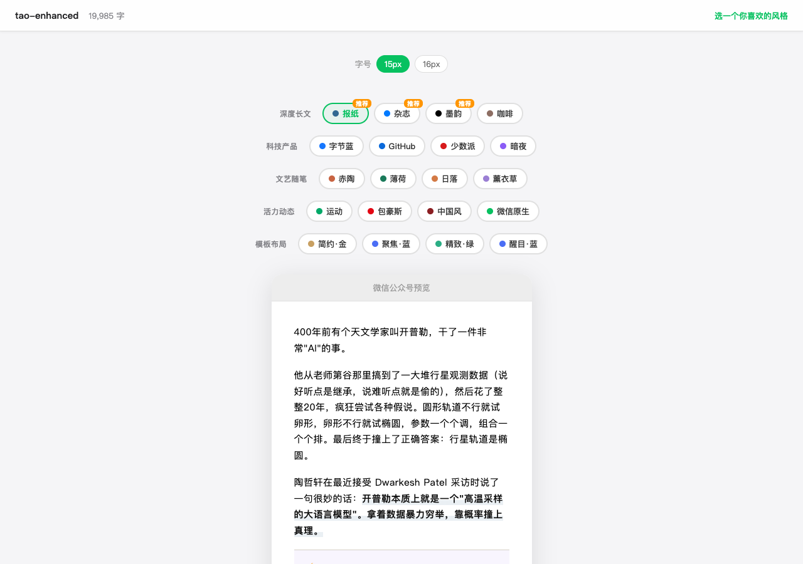

# wechat-format

微信公众号文章排版工具：把 Markdown 或纯文本文章转成适合微信公众号编辑器粘贴的 HTML。



## 功能

- **排版引擎**：Markdown 转微信公众号兼容的内联样式 HTML
- **30 套主题**：5 大分类（深度长文 / 科技产品 / 文艺随笔 / 活力动态 / 模板布局），可视化画廊选择
- **轻量增强**：支持 dialogue / callout / gallery / longimage 等容器语法
- **CJK 排版修复**：中英文自动加空格、加粗标点自动移出标记
- **图片处理**：自动处理标准 Markdown `` 引用
- **外链转脚注**：微信不支持外链，自动转文末脚注
- **主题画廊**：浏览器中用真实文章预览多个主题，点选即用

## 安装

```bash
cd ~/.claude/skills/
git clone YOUR_REPO_URL wechat-format
cp wechat-format/config.example.json wechat-format/config.json
python3 -m pip install -r wechat-format/requirements.txt
```

`scripts/format.py` 依赖第三方 Python 包 `markdown`。新环境首次运行前，先安装上面的依赖。

## 配置

编辑 `config.json`：

```json
{
  "output_dir": "/tmp/wechat-format",
  "settings": {
    "default_theme": "newspaper",
    "auto_open_browser": true
  }
}
```

- `settings.default_theme` 控制默认主题
- `settings.auto_open_browser` 控制是否自动打开浏览器预览

## 使用

在 Claude Code 里直接说：

```
排版这篇文章 /path/to/article.md
```

### 主题画廊（推荐）

```bash
python3 scripts/format.py --input article.md --gallery --recommend newspaper magazine ink
```

在浏览器中用真实文章预览 20 个核心主题；同一浏览器会记住你上次选过的主题，复制后直接去公众号后台粘贴即可。

### 指定主题排版

```bash
python3 scripts/format.py --input article.md --theme newspaper
```

## 主题一览

### 独立风格（9 个）

| 主题 | 命令值 | 风格 |
|------|--------|------|
| 赤陶 | terracotta | 暖橙色，满底圆角标题 |
| 字节蓝 | bytedance | 蓝青渐变，科技现代 |
| 中国风 | chinese | 朱砂红，古典雅致 |
| 报纸 | newspaper | 纽约时报风，严肃深度 |
| GitHub | github | 开发者风，浅色代码块 |
| 少数派 | sspai | 中文科技媒体红 |
| 包豪斯 | bauhaus | 红蓝黄三原色，先锋几何 |
| 墨韵 | ink | 纯黑水墨，极简留白 |
| 暗夜 | midnight | 深色底+霓虹色 |

### 精选风格（7 个）

| 主题 | 命令值 | 风格 |
|------|--------|------|
| 运动 | sports | 渐变色带，活力动感 |
| 薄荷 | mint-fresh | 薄荷绿，清爽 |
| 日落 | sunset-amber | 琥珀暖调 |
| 薰衣草 | lavender-dream | 紫色梦幻 |
| 咖啡 | coffee-house | 棕色暖调 |
| 微信原生 | wechat-native | 微信绿 |
| 杂志 | magazine | 超大留白 |

### 模板系列（14 个）

四种布局（简约 / 聚焦 / 精致 / 醒目）× 多种配色（金 / 蓝 / 红 / 绿 / 藏青 / 灰）

## 容器语法

文章中可使用以下容器增强排版：

```markdown
:::dialogue[对话标题]
张三：你好
李四：你好啊
:::

:::gallery[图片标题]


:::

> [!important] 核心观点
> 这里是重点内容

> [!tip] 小技巧
> 实用提示
```

## 自定义主题

在 `themes/` 目录下创建 JSON 文件。参考 `themes/newspaper.json`。

## 依赖

- Python 3
- `markdown` 库（已写入 `requirements.txt`）

## License

MIT
